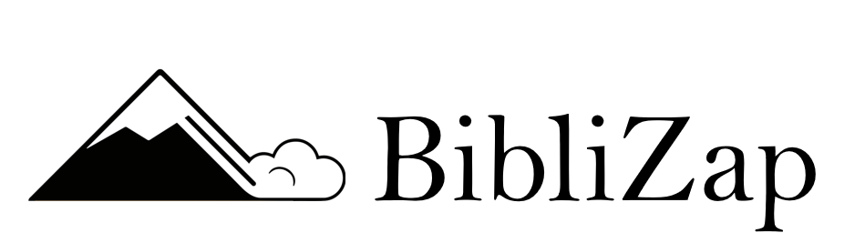
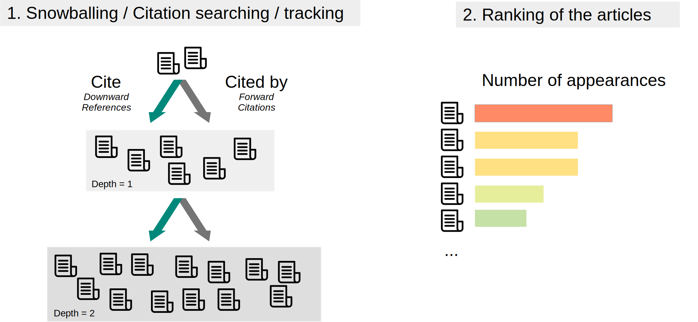

# BibliZap
Recursivity-based related articles search engine

## Principle
BibliZap aims to catalog articles similar to the source article based on both upward and downward citations. Downward citations correspond to the references of the articles (their bibliography). Upward citations correspond to the articles citing the source article. Here is a diagram summarizing the process:

At each level, the number of times each PMID appears is recorded. At the end of the process, the sum of occurrences provides the score. For instance, if an article is found once in the references of the source article, then is discovered 6 times in the articles cited by the articles that are cited by the source article, and is not found elsewhere, its score will be 7.

BibliZap is based on multi-level bidirectionnal citation searching, a technique explored here: 

Hinde, S., Spackman, E. Bidirectional Citation Searching to Completion: An Exploration of Literature Searching Methods. PharmacoEconomics 33, 5–11 (2015). https://doi.org/10.1007/s40273-014-0205-3

## Credits
BibliZap was created by Victor Leblanc, Bastien Le Guellec and Raphaël Bentegeac (Univ Lille)
Faculty: Aghiles Hamroun, Rémi Lenain, Emmanuel Chazard (Univ Lille)
